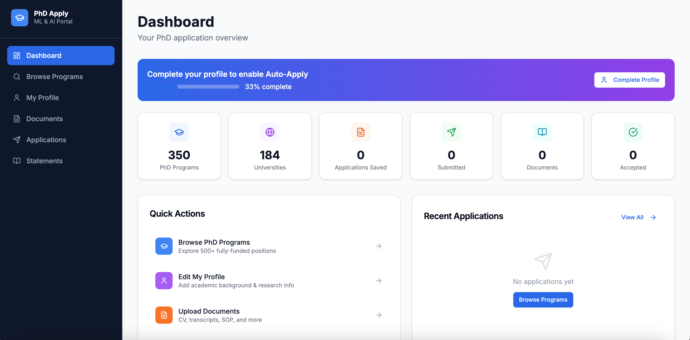

# PhD Applicant

**🌐 Live: [phd-applicant.vercel.app](https://phd-applicant.vercel.app)**

An **Agentic AI-powered** platform to browse, track, and auto-submit PhD applications with a single click — built with Next.js, MongoDB Atlas, and Claude AI. The AI agent reads your profile and documents, navigates each university's application portal, fills every form field, uploads your files, and submits — autonomously, end to end.

    



---

## Agentic AI — 1-Click Auto-Apply

> Powered by **Claude AI (Anthropic)**

Most PhD applicants spend weeks manually copying the same information across dozens of portals. This platform eliminates that entirely.

When you click **Auto-Apply**, a Claude-powered AI agent takes over:

1. **Reads your profile** — name, GPA, research experience, test scores, interests
2. **Loads your documents** — CV, transcripts, SOP, letters of recommendation
3. **Opens the application portal** — navigates to the university's system autonomously
4. **Fills every form field** — maps your profile data to each field intelligently, handling different field names and formats across portals
5. **Uploads your files** — attaches the right documents to the right upload slots
6. **Submits the application** — confirms submission and updates your tracker

The agent supports all major portal types used by top universities:

| Portal | Example Universities |
|---|---|
| ApplyYourself | MIT, Stanford, Berkeley, Cornell |
| Slate | CMU, Northeastern |
| CollegeNET | Illinois, Brown |
| Custom / Generic | Oxford, ETH Zurich, Toronto, and all others |

No more copy-pasting. No more forgetting fields. Apply to 50 programs with the same effort as one.

---

## Features

- **1-click Auto-Apply** — Claude AI agent autonomously fills and submits applications on your behalf
- **350+ PhD programs** across top US and international universities, filterable by research area, country, funding, and deadline
- **Profile builder** — fill once, the AI agent uses it to auto-fill every application
- **Document vault** — upload CV, transcripts, SOP, and letters of recommendation; the agent attaches them automatically
- **Statements editor** — write and version your Statement of Purpose, personal statement, diversity essay, and research statement
- **Application tracker** — full status board (Saved → Submitted → Interview → Decision)
- **Demo mode** — simulates the full AI submission flow so you can explore the UX without connecting the agent

---

## Tech Stack

| Layer | Technology |
|---|---|
| Frontend | Next.js 16, React 19, Tailwind CSS, shadcn/ui |
| Database | MongoDB Atlas + Prisma ORM |
| AI Agent | Claude AI (Anthropic) — agentic form filling & submission |
| Automation | Python, FastAPI, Playwright |
| File storage | MongoDB + local `public/docs/` |
| Auth | NextAuth.js — credentials-based, DB-only user management |

---

## Prerequisites

- Node.js 18+
- Docker (for MongoDB)
- Python 3.10+ (only for automation service)

---

## Getting Started

### 1. Clone and install

```bash
git clone https://github.com/centrixsol/phd-applicant.git
cd phd-applicant
npm install
```

### 2. Start MongoDB

```bash
docker run -d --name mongodb -p 27017:27017 mongo:latest mongod --replSet rs0
docker exec mongodb mongosh --eval 'rs.initiate({_id:"rs0",members:[{_id:0,host:"localhost:27017"}]})'
```

### 3. Configure environment

Copy `.env` and set your values:

```bash
cp .env .env.local
```

```env
DATABASE_URL="mongodb://localhost:27017/phd-applicant"
NEXTAUTH_SECRET="your-secret-here"
NEXTAUTH_URL="http://localhost:3000"
UPLOAD_DIR="./public/docs"
AUTOMATION_SERVICE_URL="http://localhost:8000"
```

### 4. Set up the database

```bash
npm run db:push    # sync schema to MongoDB
npm run db:seed    # seed 350 PhD programs
```

### 5. Run the app

```bash
npm run dev
```

Open [http://localhost:3000](http://localhost:3000)

---

## Automation Service (optional)

The automation service uses Playwright to submit applications automatically.

```bash
cd automation
bash start.sh
```

This installs Python dependencies, Playwright browsers, and starts the FastAPI server on port 8000. Without it, the app runs in **Demo Mode** — all UI flows work but no real submission happens.

### Supported portals

| Portal | Universities |
|---|---|
| ApplyYourself | MIT, Stanford, Berkeley, Cornell, and many others |
| Slate | CMU, Northeastern, and others |
| CollegeNET | Illinois, Brown, and others |
| Custom/Generic | Oxford, ETH Zurich, Toronto, and all remaining |

---

## Application Flow

1. Browse 350+ programs → filter by research area, country, funding
2. Save programs you want to apply to
3. Complete your profile — the Claude AI agent reads this to fill forms
4. Upload your documents — CV, transcripts, SOP, LOR
5. Write your statements — SOP, personal statement, diversity essay
6. Go to **Applications** → click **Auto-Apply** (1 click)
7. Claude AI takes over — navigates the portal, fills forms, uploads docs, submits
8. Track status from Submitted → Interview → Decision

---

## Database Commands

```bash
npm run db:push      # sync Prisma schema to MongoDB
npm run db:seed      # seed all programs (safe to re-run)
npm run db:reset     # force-reset + re-seed
npm run db:studio    # open Prisma Studio GUI
```

---

## Project Structure

```
phd-applicant/
├── src/
│   ├── app/
│   │   ├── api/           # Next.js API routes (profile, programs, documents, applications, statements)
│   │   ├── dashboard/     # Overview & stats
│   │   ├── programs/      # Browse & filter 350+ programs
│   │   ├── applications/  # Track saved applications
│   │   ├── documents/     # Upload & manage documents
│   │   ├── statements/    # Write SOP & essays
│   │   └── profile/       # Personal & academic info
│   ├── components/        # Reusable UI components (shadcn/ui)
│   └── lib/               # Prisma client, utilities
├── prisma/
│   ├── schema.prisma      # MongoDB schema
│   └── seed.ts            # 350 PhD programs seed data
├── automation/
│   ├── engine.py          # Playwright automation engine
│   ├── main.py            # FastAPI service
│   └── start.sh           # Setup & launch script
└── public/docs/           # Uploaded documents (gitignored)
```

---

## License

MIT
